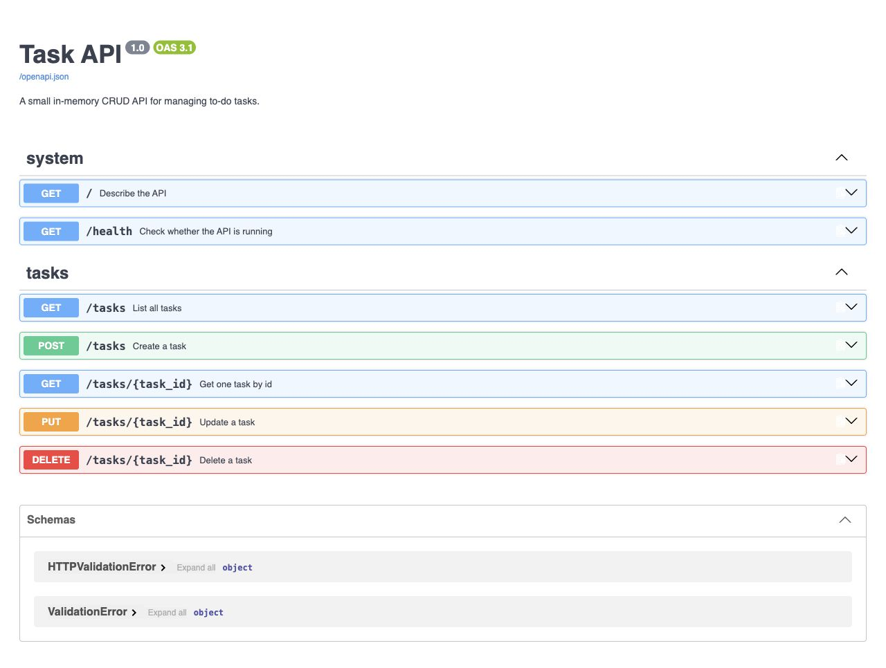

# Task API

A small FastAPI CRUD API for managing to-do tasks. It uses SQLite for persistent storage, so tasks survive when the server stops and starts again. Swagger UI is available at `/docs`.

## Why SQLite

SQLite was chosen because it stores the database in one local file, needs no separate database server, and works with Python's built-in `sqlite3` module. This keeps the project simple while still giving the API real persistence.

The database file is `tasks.db` in the project root. It is created automatically when the app starts, along with the `tasks` table and three seed tasks if the table is empty. `tasks.db` is git-ignored so each fresh clone starts with its own clean database.

## Install

```bash
python3 -m venv .venv
.venv/bin/python -m pip install -r requirements.txt
```

## Run

```bash
.venv/bin/python -m uvicorn main:app --reload
```

The API runs at `http://127.0.0.1:8000`.

## Endpoints

| Method | Path | Description | Success |
| --- | --- | --- | --- |
| GET | `/` | API name, version, and endpoint list | `200 OK` |
| GET | `/health` | Server health check | `200 OK` |
| GET | `/tasks` | List all tasks from SQLite | `200 OK` |
| GET | `/tasks/{task_id}` | Get one task by id from SQLite | `200 OK` |
| POST | `/tasks` | Create a task with `{"title": "Buy milk"}` | `201 Created` |
| PUT | `/tasks/{task_id}` | Update a task title and/or done state | `200 OK` |
| DELETE | `/tasks/{task_id}` | Delete a task | `204 No Content` |

Errors use JSON, for example `{"error": "Task 99 not found"}`. Invalid request bodies return `400 Bad Request`; unknown task ids return `404 Not Found`.

## Example curl output

```bash
curl -i -X POST http://127.0.0.1:8000/tasks \
  -H "Content-Type: application/json" \
  -d '{"title":"Buy milk"}'
```

```text
HTTP/1.1 201 Created
content-type: application/json

{"id":4,"title":"Buy milk","done":false}
```

## SQLite checks

Open `tasks.db` in DB Browser for SQLite to view the same rows that the API returns. One useful query from the assignment is:

```sql
SELECT * FROM tasks WHERE done = 1;
```

That query returns only completed tasks, because SQLite stores `done` as `1` for true and `0` for false.

## Swagger UI

Open `http://127.0.0.1:8000/docs` after starting the server.



## Publish to GitHub

After creating a public GitHub repository, connect and push this local repo:

```bash
git remote add origin <your-github-repo-url>
git push -u origin main
```
